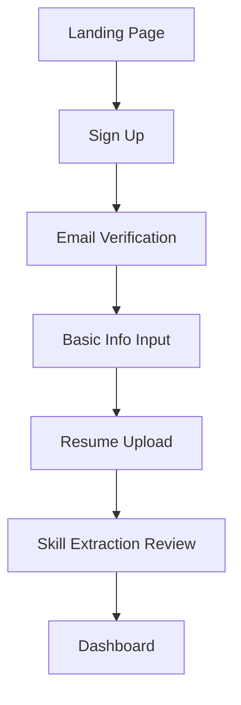
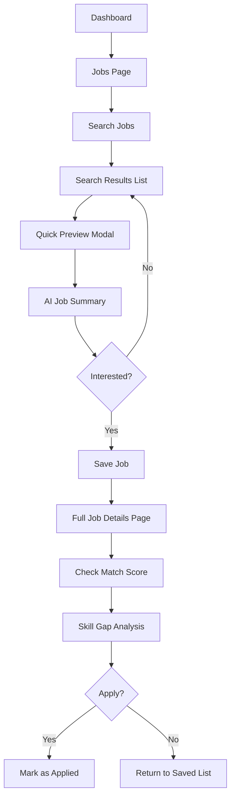
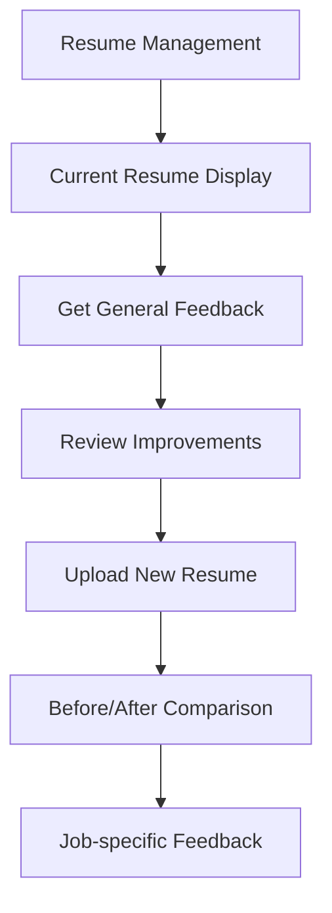
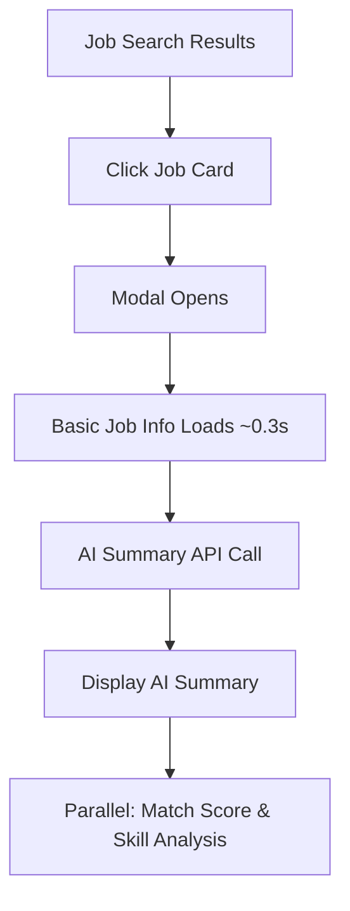

# ResMatch - User Flow Design

## 🎯 Main User Journeys

### 1. First-time User Registration & Onboarding



**Detailed Flow:**

1. **Landing** → Service introduction & registration button
2. **Sign Up** → Email & password input
3. **Email Verification** → Confirmation email sent & clicked
4. **Basic Info** → Name, job title, years of experience, etc.
5. **Resume Upload** → PDF/Word format support
6. **Skill Review** → User confirms & edits AI-extracted results
7. **Dashboard** → Navigate to main screen

### 2. Daily Job Search & Management Flow



### 3. Resume Improvement Flow



## 📱 Screen Transition Details

### Main Screen Structure

1. **Dashboard** (`/dashboard`)

   - KPI display (saved, matched, applied job counts)
   - Recent activities
   - Quick actions

2. **Job Management** (`/jobs`)

   - Integrated search & list screen (`/jobs` with search functionality)
   - Quick preview modal (for search results)
   - Detail screen (`/jobs/:id`)
   - AI-powered job summaries
   - Match analysis (integrated in detail screen tabs)

3. **Resume Management** (`/resume`)

   - Upload screen
   - Display & edit screen
   - Feedback screen (`/resume/feedback`)

4. **Analytics Screen** (`/analytics`)

   - Statistics dashboard
   - Time series graphs
   - Skill analysis

5. **Settings** (`/settings`)
   - Profile editing
   - Notification settings
   - Account management

## 🤖 AI-Enhanced Features

### Job Summary Generation Flow



### Performance Optimization Strategy

- **Progressive Loading**: Basic info → AI summary → detailed analysis
- **Parallel API Calls**: Independent APIs run simultaneously
- **Modal Preview**: Quick job overview before full page navigation
- **Error Handling**: Graceful fallbacks with retry mechanisms

## 🔄 State Management Flow

### Job Status Transitions

```
Search Results → Quick Preview → Saved → Applied
                      ↓              ↓
                 AI Summary      Matched
```

### Data Flow

1. **Authentication State**

   - Login status
   - User information
   - Token management

2. **Job Data**

   - Search results cache
   - Saved jobs list
   - Status updates

3. **Resume Data**
   - Upload status
   - Extracted text
   - Feedback results

## 🎨 UI/UX Guidelines

### Usability

- **One-click save**: Save jobs with single click
- **Progress bars**: Show progress for long processes (AI analysis, etc.)
- **Real-time updates**: Immediate reflection of status changes

### Visual Feedback

- **Match scores**: 0-100 score + color coding
- **Skill gaps**: Highlight missing skills
- **Application status**: Visual status badges

### Responsive Design

- **Mobile**: Touch-optimized interactions
- **Tablet**: 2-column layout
- **Desktop**: Sidebar + main content

## 📊 Key Metrics

### User Engagement

- Daily job views
- Resume feedback usage rate
- Job application rate

### System Performance

- Page load times
- API response times
- Error rates
